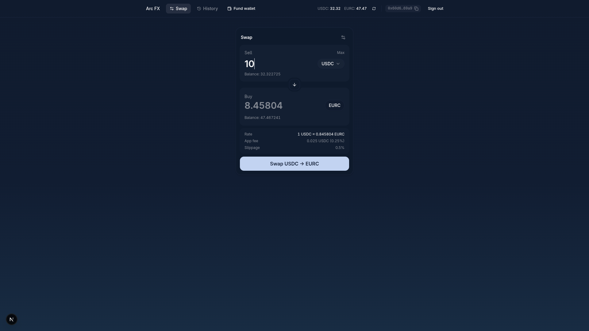

# Arc Stablecoin FX

This sample app demonstrates stablecoin FX swaps between USDC and EURC using the App Kits Swap SDK and Circle Developer Controlled Wallets on Arc.



## Table of Contents

- [Prerequisites](#prerequisites)
- [Getting Started](#getting-started)
- [How It Works](#how-it-works)
- [Project Layout](#project-layout)
- [Environment Variables](#environment-variables)
- [Available Scripts](#available-scripts)
- [Testing](#testing)
- [Security & Usage Model](#security--usage-model)
- [Legal](#legal)

## Prerequisites

- **Node.js v20+** and npm
- **Docker Desktop** — Runs Supabase locally. [Install Docker Desktop](https://www.docker.com/products/docker-desktop/)
- A [Circle](https://console.circle.com) account with API key + entity secret. The same API key authenticates App Kit swaps

## Getting Started

1. Install dependencies:

   ```bash
   npm install
   ```

2. Start the local Supabase stack (requires Docker Desktop running):

   ```bash
   npm run db:start
   ```

   This boots Postgres, Auth, etc. via the Supabase CLI and runs the migrations in `supabase/migrations/`. The output shows the Supabase URL and API keys needed in the next step; run `npm run db:status` to see them again.

3. Set up environment variables:

   ```bash
   cp .env.example .env.local
   ```

   Then edit `.env.local` and fill in all required values (see [Environment Variables](#environment-variables) below). `NEXT_PUBLIC_SUPABASE_URL` / `NEXT_PUBLIC_SUPABASE_PUBLISHABLE_KEY` / `SUPABASE_SECRET_KEY` come from `npm run db:status`. Leave `APP_FEE_RECIPIENT` blank, the next step fills it in.

4. Provision the platform fee wallet:

   ```bash
   npm run wallet:generate
   ```

   Creates a Circle wallet to receive swap fees and writes its address back to `.env.local` as `APP_FEE_RECIPIENT`.

5. Start the development server:

   ```bash
   npm run dev
   ```

   The app will be available at `http://localhost:3000`.

## How It Works

- Built with [Next.js](https://nextjs.org/) App Router and [Supabase](https://supabase.com/) (auth + trade history)
- Uses [Circle Developer Controlled Wallets](https://developers.circle.com/wallets/dev-controlled) to hold each user's USDC/EURC
- Utilizes `@circle-fin/app-kit`'s Swap SDK (`kit.swap` / `kit.estimateSwap`) for USDC ⇄ EURC swaps on Arc Testnet
- A platform-level fee (`APP_FEE_BPS`) is applied to every swap and routed to `APP_FEE_RECIPIENT`, a Circle wallet provisioned via `npm run wallet:generate`
- [Circle webhooks](https://developers.circle.com/api-reference/webhook-endpoints) (`/api/webhooks/circle`) keep cached wallet balances in Supabase in sync with on-chain settlement
- Styled with [Tailwind CSS](https://tailwindcss.com) and components from [shadcn/ui](https://ui.shadcn.com/)

## Project Layout

- `src/app/(auth)/` - register / login flows
- `src/app/(app)/dashboard/` - authenticated swap panel
- `src/app/(app)/dashboard/history/` - trades history
- `src/app/api/webhooks/circle/` - Circle webhook receiver
- `src/components/swap/`, `src/components/trades/`, `src/components/wallet/` - feature UI
- `src/lib/circle/`, `src/lib/appkit/` - Circle wallets + App Kit integration
- `src/lib/supabase/` - Supabase client/server/admin helpers
- `supabase/migrations/` - database schema
- `scripts/` - one-off operator scripts

## Environment Variables

Copy `.env.example` to `.env.local` and fill in the required values:

```bash
# Supabase (local stack)
NEXT_PUBLIC_SUPABASE_URL=http://127.0.0.1:54321
NEXT_PUBLIC_SUPABASE_PUBLISHABLE_KEY=
SUPABASE_SECRET_KEY=

# Circle
CIRCLE_API_KEY=
CIRCLE_ENTITY_SECRET=
CIRCLE_BLOCKCHAIN=ARC-TESTNET
NEXT_PUBLIC_ARC_CHAIN=Arc_Testnet

# Optional
CIRCLE_WEBHOOK_SECRET=

# Platform fee
APP_FEE_BPS=25
APP_FEE_RECIPIENT=
```

| Variable | Scope | Purpose |
| --- | --- | --- |
| `NEXT_PUBLIC_SUPABASE_URL` | Public | Supabase API URL. From `npm run db:status`. |
| `NEXT_PUBLIC_SUPABASE_PUBLISHABLE_KEY` | Public | Supabase publishable key. From `npm run db:status`. |
| `SUPABASE_SECRET_KEY` | Server-side | Supabase secret key, used only by the admin client. From `npm run db:status`. |
| `CIRCLE_API_KEY` | Server-side | Circle API key for wallets, webhook signature lookups and App Kit swaps. |
| `CIRCLE_ENTITY_SECRET` | Server-side | 32-byte hex (64 chars) entity secret. Must be registered with Circle once before use. |
| `CIRCLE_BLOCKCHAIN` | Server-side | Circle blockchain identifier. Defaults to `ARC-TESTNET`. |
| `NEXT_PUBLIC_ARC_CHAIN` | Public | App Kit chain identifier. Defaults to `Arc_Testnet`. |
| `CIRCLE_WEBHOOK_SECRET` | Server-side | Optional. If set, `/api/webhooks/circle` also requires it as a bearer token on top of Circle's signature. |
| `APP_FEE_BPS` | Server-side | Platform fee in basis points applied to every swap. Defaults to `25` (0.25%). |
| `APP_FEE_RECIPIENT` | Server-side | Address that receives swap fees. Leave blank, then run `npm run wallet:generate`. |

## Available Scripts

- `npm run dev` — Start the Next.js development server
- `npm run build` — Create a production build
- `npm run start` — Start the production server
- `npm run lint` — Run ESLint
- `npm test` — Run the unit tests (no services needed)
- `npm run test:integration` — Run database tests against the local Supabase (`npm run db:start` first)
- `npm run db:start` / `db:stop` / `db:status` / `db:reset` — Manage the local Supabase instance
- `npm run wallet:generate` — Create the platform fee wallet and write its address to `.env.local`

## Testing

- `npm test` runs the unit tests in `tests/unit`. They need no network, database or Circle credentials.
- `npm run test:integration` runs `tests/integration` against the local Supabase stack (row level security and swap guards).

Nothing here calls Circle: quotes, swaps and wallet creation are mocked, so a real swap still has to be tried by hand with your own credentials.

## Security & Usage Model

This sample application:
- Assumes testnet usage only
- Handles secrets via environment variables
- Verifies Circle's signature on every webhook
- Is not intended for production use without modification

See `SECURITY.md` for vulnerability reporting guidelines. Please report issues privately via Circle's bug bounty program.

## Legal

Sample apps provided for demonstration and educational purposes only, intended for Arc testnet use only, and not production-ready. See [Arc.io](https://arc.io) for more.
